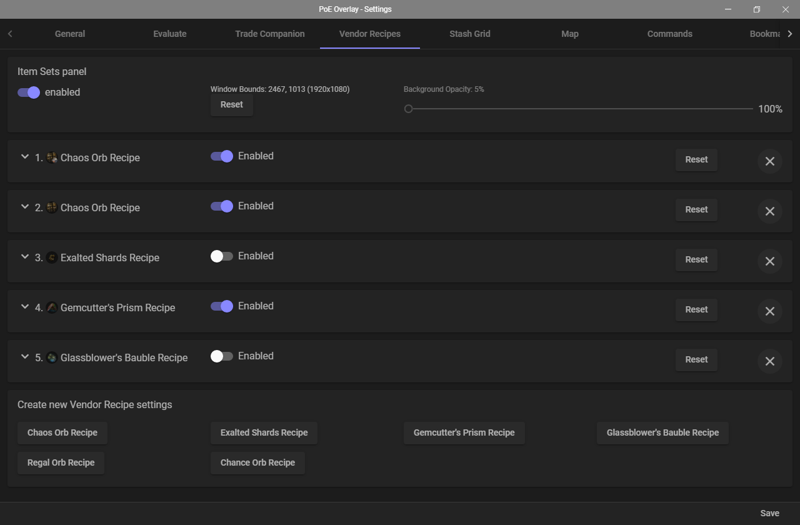
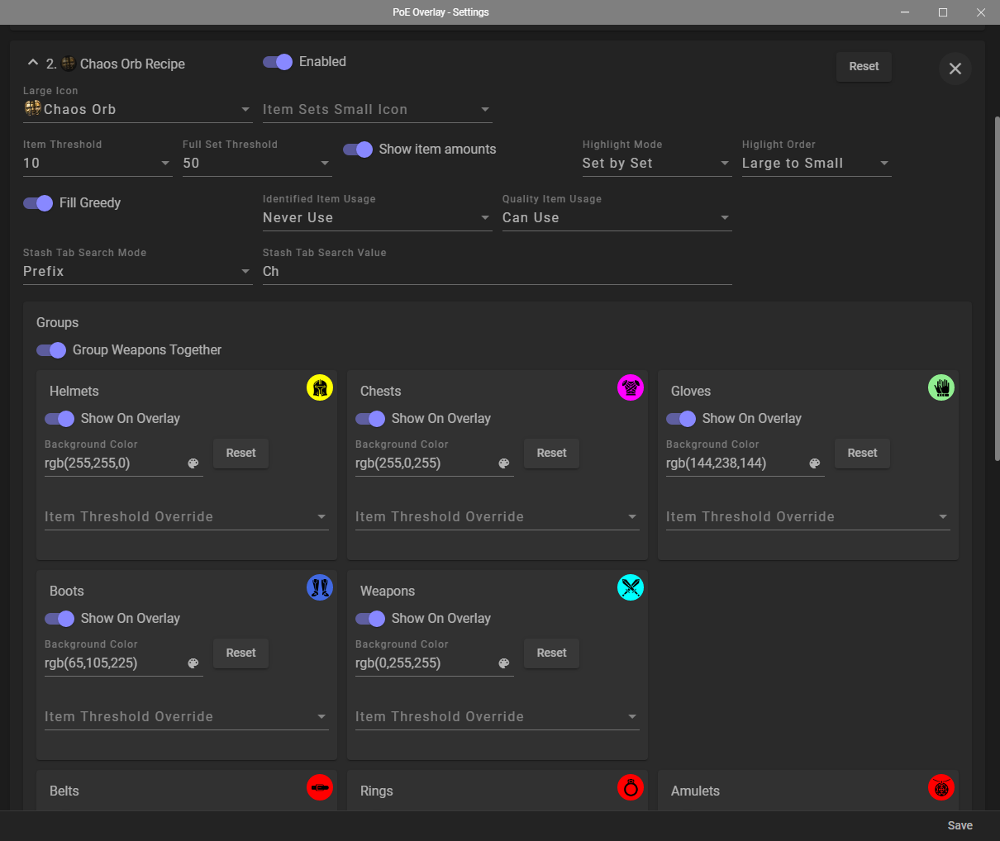
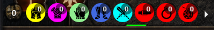

# PoE Overlay (Community Fork)

PoE Overlay is a tool for Path of Exile. The **_core aspect_** is to blend in with the game. Built with Electron and Angular.

<!-- TOC -->

- [Community Development](#community-development)
- [Features](#features)
- [Getting Started](#getting-started)
- [Roadmap](#roadmap)
- [Developer Docs](#developer-docs)
- [Authors](#authors)
- [License](#license)
- [Acknowledgments](#acknowledgments)

<!-- /TOC -->

## Community Development

This version of PoE Overlay was forked on 2020-06-10 to snapshot the app before it was
converted to utilizing Overwolf.

We have a Discord server [here](https://discord.gg/sb5mUsWpdg) where we discuss
features, bugs, and development. All are welcome to join.

## Features

### Evaluation of items

  - Select your preferred currencies and language
  - Uses the official pathofexile.com/trade website
  - A graphical display of the price distribution 

Click to see image

  - Filter your search on all supported properties on click 

Click to see image

  - An in game browser to display the created search 

Click to see image

  - Lets you price tag the item by clicking the desired bar/value

### Stash Grid Overlay

  - Configurable (positioning & coloring) grid overlay for both Normal & Quad tabs
  - Customizable colors for the grid lines, outline, background & highlighting of items
  - Used mainly in conjuction with other features (e.g. Trade Companion, Vendor Recipes, ...)

### Trade Companion

  - Inspired by MercuryTrade's trade notifications
  - Receive a (small) notification popup when being whispered (or whispering someone else) for a trade
  - Has quick-action buttons to invite, trade, dismiss, whisper, ask-if-still-interested, repeat-trade-whisper, etc...
  - Customizable buttons with your own label that send your own customizable text to the buyer/seller
  - Item highlighting to quickly find the item you're selling (uses the stash grid overlay)
  - [Demo Video](https://www.youtube.com/watch?v=unX1u6VZaCQ)

### Vendor Recipes

  - Inspired by ChaosRecipeEnhancer's chaos recipe tool
  - Configure multiple vendor recipes, using a sensible default template of the recipe type which can then be fully customized
    - It comes with templats for: Chaos Orb, Exalted Shards, Gemcutter's Prism, Glassblower's Bauble, Regal Orb and Chance Orb
    - Multiple of the same recipe van be configured with different settings for each recipe 

Click to see images
 

  - Has its own separate overlay bar which can be customized and positioned anywhere on your screen 

Click to see image

  - Highlights completed 'sets' using the stash grid overlay
  - Note: Filter updating currently isn't supported, but might be added later on
  - Note: parts of this feature require you to sign-in to your PoE account through the tool's settings menu

### Other Features

  - Bind in game commands to a custom hotkey
  - Premade /hideout on `F5` and /dnd on `F6`
  - Bind websites to hotkeys
  - Navigating storage with Ctrl + MWheel
  - Highlighting items with Alt + F
  - An in game menu to change all settings 

Click to see image

## Getting Started

### Supported Platforms

- Windows 10 x64
- Windows 7 x64 (with keyboard support enabled)
- Linux x64

### Prerequisites

- Path of Exile **_must be_** in windowed fullscreen mode
- PoE Overlay **_should run_** with privileged rights
- You **_may need_** to install [vc_redist](https://support.microsoft.com/en-us/help/2977003/the-latest-supported-visual-c-downloads)

### Installation

Head over to [Releases](https://github.com/PoE-Overlay-Community/PoE-Overlay-Community-Fork/releases) and download one of the following files:

Use `poe-overlay-Setup-<version>.exe` to install locally. This supports auto update / auto launch.

Use `poe-overlay-<version>.exe` for the portable version. This does not support auto update / auto launch.

### Usage

1. Run PoE Overlay
1. Start Path of Exile
1. Wait until you can see `PoE Overlay` in the bottom left corner
1. Hit `F7` and set `Language` and `League` to meet your game settings

### Shortcuts

You can change these shortcuts in the user settings menu.

|Shortcut  |Description
|---       |---
| `Ctrl+D` | Displays the item in a frame and evaluates the price. You can open the offical trade site on click of the currency value
| `F7`     | Opens the user settings menu

Click to see full list

|Shortcut        |Description
|---             |---	    
| `Ctrl+D`       | Displays the item in a frame and evaluates the price. You can open the offical trade site on click of the currency value
| `Alt+T`        | As above - displays the item translated
| `Alt+W`        | Opens item in wiki
| `Ctrl+Alt+W`   | As above - but in external browser
| `Alt+G`        | Opens item in poedb
| `Ctrl+Alt+G`   | As above - but in external browser
| `Alt+Q`        | Shows map info (layout, bosses)
| `Alt+F`        | Highlights item in stash
| `Ctrl+MWheel`  | Navigates through stash tabs
| `F5`           | Go to Hideout
| `F6`           | Toggle DND
| `F7`           | Opens the user settings menu
| `F8`           | Exits overlay
| `Alt + Num1`   | Open `https://www.poelab.com/`
| `Alt + Num2`   | Open `https://wraeclast.com/`
| `Esc`          | Close latest dialog
| `Space`        | Close all dialogs

## Roadmap

| Module  | Status      | Notes                                   |
| ------  | ----------- | --------------------------------------- |
| Linux   | In Progress | - Allow running this app on Linux       |
| Vulkan  | In Progress | - Support for Vulkan video modes        |

## Developer Docs

See [here](DEVELOPERS.md).

## Authors

- **Nicklas Ronge** - _Initial work_ - [Kyusung4698](https://github.com/Kyusung4698)
- **WhiteFang** - _Trade Companion, Vendor Recipes, Grid Stash Overlay_ - [WhiteFang5](https://github.com/WhiteFang5)

See also the list of [contributors](https://github.com/PoE-Overlay-Community/PoE-Overlay-Community-Fork/contributors) who participated in this project.

## License

This project is licensed under the MIT License - see the [LICENSE.md](LICENSE.md) file for details

## Acknowledgments

- [Grinding Gear Games](https://www.pathofexile.com/) the game
- [PoE TradeMacro](https://github.com/PoE-TradeMacro/POE-TradeMacro) initial inspiration
- [poe.ninja](https://poe.ninja/) currency values
- [libggpk](https://github.com/MuxaJIbI4/libggpk) parsing content.ggpk
- [Mercury Trade](https://github.com/Exslims/MercuryTrade) inspiration for the Trade Companion
- [SignPath.io](https://signpath.io/) for the free code signing  

- [Smashicon via Flaticon.com](https://www.flaticon.com/authors/smashicons) for the Vendor Recipe icons

## Disclosures

### Client Logs

The app reads and parses the client log file generated by the game for the purpose of obtaining whisper and trade-related data such as joining/leaving of players.

### PoE Account Sign-in

The app allows signing in to your PoE Account. Doing so will accumlate the following account data for usage within the app:
* Account profile info [name, realm, etc...] (to show that you're logged in, and used to access other account-related data such as stashes, characters, etc...)
* A List of private leagues (to allow selecting them from the Leagues list in the settings)
* Stash info [names, types, etc...] (to allow the appropriate grid overlay to be shown)

### Privacy

The app does not collect and distribute/communicate any personal data to a third-party website/location/service.  

### Third-Party Notice

This app isn't affiliated with Grinding Gear Games in any way.  
